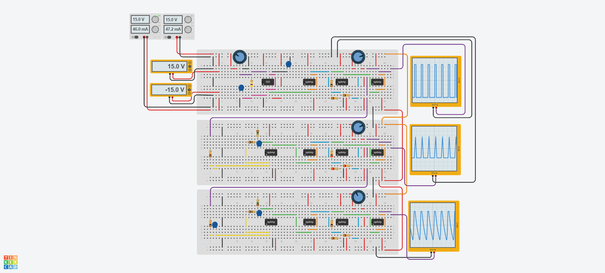

## 🔊 Analog Signal Generator
This project is part of my portfolio of evidence in electronic engineering.

The Analog Signal Generator simulates the generation of three fundamental waveforms:

> ⬛ Square wave

> 🔺 Triangular wave

> 〰️ Sine wave

The circuit is designed using basic analog building blocks including the 555 Timer IC and operational amplifiers. Simulation was performed in Tinkercad.

---

## 🖼️ Gallery

Circuit In Operation:
		
 

---

## 📝 Overview
- A square wave is generated using an astable 555 timer.

- A potentiometer is included to allow variable frequency control (0–1kHz range).

- The square wave output is passed through a buffer and summer circuit to allow for DC offset adjustment.

- A final voltage follower buffers the adjusted square wave output for further use.

- A triangular wave is generated by passing the buffered square wave through an integrator circuit.

- The integrator uses a 100Ω series resistor and 1MΩ feedback resistor as detailed in the schematic, with the smaller series resistor limiting the current draw on the operational amplifier (protection) and the larger resistor preventing DC offset integration.

- The triangular wave is buffered before further processing.

- A sine wave is generated by passing the buffered triangular wave through another integrator stage.

- This stage smooths the triangular waveform into a sinusoidal shape.

- All waveforms are passed through unity-gain voltage follower (buffer) circuits for impedance buffering (high input impedance, low output impedance) ensuring minimal signal loading or degradation.

---

## 🔬 Circuit Simulation
Platform: Autodesk Tinkercad

Circuit includes:
- ⚡ Power supply: ±15V dual-rail setup
- 
- 🔌 Breadboards

- ⏱️ 555 Timer IC

- 🔧 General-purpose op-amps

- 🔌 Resistors, capacitors, and potentiometers

- 📊 Oscilloscopes to monitor waveform outputs

---

## ⚠️ Current Limitations and Planned Improvements
> 🔄 555 Timer circuit must be modified to allow for variable duty cycles in addition to the current variable frequency control.

> 🔍 Explore the benefits and limitations of replacing the 555 Timer circuit with a Relaxation Oscillator circuit.

> ➕ An AC-coupling ceramic capacitor must be added to the input of the triangular waveform integrator to remove dc offsets from the square wave buffer stage.

> 🛠️ Troubleshoot why the negative halves of the triangular and sine waves appear to be clipped.

> ⚡ Address simulation slowdown issues at startup.
  (Tip: Set the slider of the frequency selecting potentiometer to an end on simulation start-up before selecting the desired frequency.)

> 📈 Research higher-performance op-amps that would allow higher-frequency waveform generation.

---

## 📜 License
This project is open-source and free to use under the MIT License.

---

## 🙏 Acknowledgements
Inspired by classic analog function generator designs

Simulated and tested using Autodesk Tinkercad!

---

## 👤 Author

Created by [Yasteer Sewpersad](https://github.com/Yasteer)  
Electronic Engineering Portfolio of Evidence
